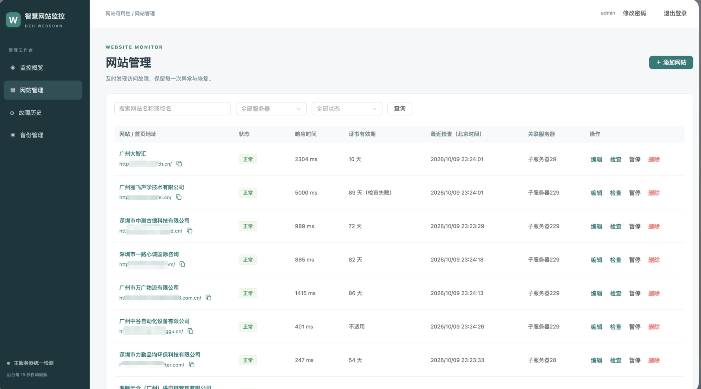

# DZH Webscan · 网站文件与可用性监控

集中监控多台服务器的网站文件变化、可疑代码、网站访问故障和 SSL 证书到期情况，通过飞书发送提醒，在网站后台和 Grafana 中查看状态与历史。

项目仓库：[GitHub · gzdzh-cn/dzh-webscan](https://github.com/gzdzh-cn/dzh-webscan)。默认使用 Docker Hub 公开镜像 `latest`，支持 **Linux amd64（x86_64）**。服务器无需安装 Go、Python 或 Node.js。

## 能做什么

| 功能 | 用途 |
|---|---|
| 文件安全监控 | 监听新增、修改、删除及移动；支持多个目录、自定义后缀、忽略规则和单节点配置 |
| 可疑代码扫描 | 文件变化后异步执行 YARA；配置 ClamAV 服务后可启用对应扫描 |
| 网站可用性 | 主服务器定时检查网站首页、HTTP 状态和关键词，记录故障并通知恢复 |
| SSL 证书提醒 | 列表显示剩余有效期；不超过 7 天提醒，进入过期状态补发通知，续签后通知恢复 |
| 网站管理后台 | 中文概览、筛选分页、增删改、暂停／恢复、立即检查、故障历史 |
| 账号与配置备份 | 后台修改管理员密码；一键备份网站配置、查看历史、导出／导入 JSON、预览后合并恢复 |
| 网址操作 | 点击网址在新标签打开；旁边的复制图标复制完整地址，兼容 HTTP 后台 |
| Grafana 与飞书 | 查看节点资源、监听覆盖、传输队列及日志；通过持久化队列发送告警与重试 |

添加或修改网站即时生效，无需重建容器。网站检查由**主服务器**执行；关联子服务器只用于分类和通知。文件监听由各子服务器执行。

## v2.0.30 新增功能

- **一行安装**：自动创建部署目录、下载固定发布版本并校验 SHA256，设置文件权限。
- **首次配置向导**：填写主服务器、SSL、后台、飞书和监控目录，支持隐藏输入凭据及多台子服务器。
- **全局管理命令**：安装入口注册宿主机 `webscan`，以后在主服务器任意目录打开菜单或执行维护命令。
- **重复执行保护**：保留已有 YAML，脚本有新版时备份后更新；同版跳过重复下载，未完成任务保留原版本。
- **先安装主服务器**：可不添加子服务器；以后从菜单 **4 → N** 录入新节点并直接安装验收。

[版本更新说明](docs/CHANGELOG.md#v2030) · [首次配置向导](docs/INSTALLATION.md#首次配置向导) · [重复执行说明](docs/INSTALLATION.md#再次执行安装命令)。下载入口和镜像发布不会自动升级运行中的容器，安装或升级仍由管理员在菜单中选择。

## 网站监控面板



后台采用 **Vue 3 + Vite + TypeScript + Element Plus**，构建后嵌入 GoFrame 程序，随 `webscan-central` 镜像运行，无需额外前端容器。

- **监控概览与网站管理**：查看正常／异常网站、响应时间、最近检查和证书有效期，添加网站或立即检查。
- **故障历史**：查看故障原因、开始时间与恢复情况。
- **备份管理**：备份全部网站配置，导出或导入 JSON；恢复按网址合并，保留其他网站及原故障历史。配置备份不包含密码、历史或通知队列。
- **修改密码**：右上角操作，成功后全部会话退出；重启、升级和保留数据的重装沿用新密码。

操作步骤见 **[网站后台使用指南](docs/WEBSITE.md)**，包括登录、宝塔反代、备份恢复、证书判断与访问排查。

### 怎么打开面板

开启 YAML 中的 `central.website_monitor.enabled`，部署成功后按 SSL 设置访问：

| 访问方式 | 地址示例 | 网络要求 |
|---|---|---|
| 直接访问，SSL 开启 | `https://主服务器IP:19444/login` | 主服务器云安全组及宝塔／系统防火墙允许管理来源访问 TCP `19444`；需信任部署 CA |
| 直接访问，SSL 关闭 | `http://主服务器IP:19444/login` | 同上；使用 HTTP 协议 |
| 同机宝塔域名反代 | `https://monitor.example.com/login` | 对外开放 TCP `443`；后台绑定 `127.0.0.1` 时无需公网开放 `19444` |

端口以 `central.website_monitor.host_port` 为准。**网站后台默认 19444，Grafana 默认 3000，节点事件接口默认 19443，三者用途不同。** 网站后台账号与 Grafana 分开；初始密码见部署完成提示，后台改密后使用新密码。

旧 YAML 未配置网站后台时默认关闭；新示例默认开启。[如何开启与登录](docs/WEBSITE.md#开启与登录) · [宝塔反向代理配置](docs/WEBSITE.md#宝塔域名反向代理)。SSL 总开关同时控制节点通信、指标采集和网站后台；切换协议需更新全部启用节点，不能仅升级主服务器。

## 安装方式

**推荐第 1 种 SH 自动部署**：在主服务器操作一次，统一配置和部署各子服务器，并完成验收、通知与回退。两种方式选一种使用。

1. **[SH 自动部署（推荐）](#1sh-自动部署推荐)**：主服务器执行脚本，适合首次安装和日常集中维护。
2. **[Docker Compose 手动部署](#2docker-compose-手动部署)**：本地生成配置包，再分别上传各台服务器执行 Compose。

### 1、SH 自动部署（推荐）

在 **Linux amd64 主服务器的 root SSH 终端**执行：

```bash
bash -o pipefail -c 'curl -fsSL https://github.com/gzdzh-cn/dzh-webscan/releases/latest/download/install.sh | bash'
```

入口自动创建 `/root/webscan-deploy`，下载并验证部署脚本与示例配置，设置权限。首次向导引导填写主服务器 IP、SSL、飞书和监控目录，可先不添加子服务器；保存后进入菜单，选择 **1、安装**。服务器无需安装 Go、Python 或 Node.js。

安装后，在任意目录输入：

```bash
webscan
```

即可打开菜单。菜单 **4** 支持选择已有节点或交互录入新节点；菜单 **5** 完成 SSL 设置及完整部署。也可直接执行 `bash /root/webscan-deploy/deploy-webscan.sh`。

**再次输入一行安装命令**会保留已有 `webscan.yaml`、账号和数据，仅有新版本时更新脚本，然后进入菜单，不自动升级容器。已有部署但配置丢失时停止并提示恢复；存在未完成任务时保留原版本。[重复执行与文件保护](docs/INSTALLATION.md#再次执行安装命令)。

**[完整 SH 安装教程 →](docs/INSTALLATION.md)**：配置填写、飞书设置、端口、检查命令、菜单、SSL 设置及安装验收。

### 2、Docker Compose 手动部署

本地完整源码目录生成各服务器的配置包；运行服务器只需要 Docker 和 Compose：

```bash
cp webscan.example.yaml webscan.compose.yaml
chmod 600 webscan.compose.yaml
# 编辑实际服务器、路径和飞书凭据后检查、生成
go run ./cmd/compose --config webscan.compose.yaml --check
go run ./cmd/compose --config webscan.compose.yaml --output compose-deploy
```

将生成的对应目录上传到每台服务器。主服务器在自己的包目录执行 `docker compose pull` 和 `docker compose up -d`；子服务器先启动 Agent 与 exporter，确认清单和监听覆盖，再启用 Vector。

**[完整 Compose 教程 →](docs/COMPOSE.md)**。根目录 [compose.yaml](compose.yaml) 加载生成的服务配置；首次使用需先生成身份、运行配置及必要证书。

## 需要开放哪些端口

修改过端口时以 YAML 为准。**云安全组和宝塔／系统防火墙都需要允许连接**，只设置其中一处可能仍无法访问。

| 所在服务器 | 默认 TCP 端口 | 允许谁访问 | 用途 |
|---|---|---|---|
| 主服务器 | `19443` | 各子服务器 IP | 文件事件上报与接收确认 |
| 子服务器 | `19100` | 主服务器 IP | 节点健康指标采集 |
| 子服务器 | 自定义 SSH 端口 | 主服务器 IP | 部署、更新和维护 |
| 主服务器 | `19444` | 管理人员地址 | 网站管理后台；同机反代并绑定回环地址时不向公网开放 |
| 主服务器 | `3000` | 管理人员地址 | Grafana；使用反代时按实际绑定和代理配置设置 |
| 宝塔反代服务器 | `443` | 需要访问后台的地址 | HTTPS 域名入口；需要 HTTP 跳转时另外开放 `80` |

主服务器还需出站访问被监控网站与飞书；部署时各服务器需能下载镜像，子服务器需能访问主服务器事件接口。[安装网络要求](docs/INSTALLATION.md#放行网络端口) · [面板访问配置](docs/WEBSITE.md#面板端口与访问方式)。

## 架构与执行顺序

```text
文件监控：子服务器文件变化 → Agent 过滤与扫描 → Vector 传输
         → 主服务器保存事件 → 飞书通知 / Loki 日志 → Grafana 查询

网站监控：后台添加网站 → 主服务器定时检查首页、关键词和证书
         → 保存状态与历史 → 判断故障或恢复 → 飞书通知 / 后台与 Grafana 展示
```

默认网站检测间隔 60 秒，连续 **3 次失败**发送故障通知，连续 **2 次成功**发送恢复通知。404、超时、连接错误、HTTPS 校验失败或关键词缺失均可判为失败；未执行的检查不算故障。返回 200 的错误页面应设置关键词辅助识别；不抓取内页或执行 JavaScript。

证书剩余时间 **不超过 7×24 小时**独立提醒，不等待首页连续失败；每日最多提醒一次，首次过期补发，续签到超过 7 天后通知恢复。[检测与告警规则](docs/WEBSITE.md#检测与通知如何判断) · [详细架构与部署顺序](docs/ARCHITECTURE.md)。

## 常用维护命令

以下命令在主服务器任意目录执行，按需要选择：

```bash
# 完整升级主、子服务器
webscan --upgrade
# 仅升级主服务器／应用网站后台配置（不能用于切换总 SSL 协议）
webscan --upgrade --central-only
# YAML 添加节点后，安装或更新这个节点
webscan --add-node --node node-example
# 只改支持热更新的过滤规则或 YARA 时
webscan --reload-rules
```

`latest` 不会自动更新正在运行的容器，需执行部署更新。未完成任务按日志使用原版本、配置和范围恢复或回退；[维护、恢复、卸载与重装](docs/OPERATIONS.md)。

## 文档导航

| 想了解什么 | 详细文档 |
|---|---|
| 新增功能与版本变化 | [版本更新说明](docs/CHANGELOG.md) |
| 从零安装、飞书和 SSL 菜单 | [SH 自动部署教程](docs/INSTALLATION.md) |
| 按服务器手动安装 | [Docker Compose 教程](docs/COMPOSE.md) |
| 网站后台、登录、宝塔反代、改密、备份及证书 | [网站后台使用指南](docs/WEBSITE.md) |
| 各节点是否正常、日志与指标查询 | [Grafana 使用指南](docs/GRAFANA.md) |
| 多目录、自定义后缀、排除隐藏文件、单节点规则 | [文件监控规则](docs/MONITOR-RULES.md) |
| 全部 YAML 参数、填写要求与错误提示 | [参数说明](docs/PARAMETERS.md) |
| 镜像、升级、增加节点、恢复、卸载与重装 | [日常维护](docs/OPERATIONS.md) |
| 无法访问、内存不足、SSH 或通知失败 | [问题排查](docs/TROUBLESHOOTING.md) |
| 文件、网站、健康及部署执行顺序 | [架构说明](docs/ARCHITECTURE.md) |
| 本地 Vue / Go 开发、目录和镜像构建 | [开发指南](docs/DEVELOPMENT.md) |
| 仓库认证与镜像拉取 | [镜像仓库说明](docs/REGISTRY.md) |

Docker Hub 公开镜像：[gzdzh/webscan-central](https://hub.docker.com/r/gzdzh/webscan-central) · [gzdzh/webscan-agent](https://hub.docker.com/r/gzdzh/webscan-agent)。每次发布提供版本标签及 `latest`，第三方组件使用固定版本；需要回退时保留部署记录。

文档中的 IP、域名及凭据为示例，使用时替换为自己的配置。历史验收记录描述当时的结果，当前操作以本页、专题指南及实际代码为准。
