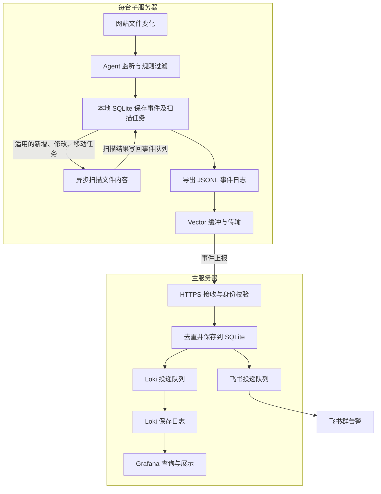

# 网站文件监控系统使用说明

这套系统用来发现网站文件的新增、修改、删除和改名，把需要关注的变化发送到飞书。它也会检查可疑代码、保存事件日志，在 Grafana 中展示各台服务器的运行状态。

默认使用 Docker Hub 的 **latest** 镜像，适用于 **Linux amd64（x86_64）** 服务器。每次发布同时保留版本号标签和 `latest`。主、子服务器的自研程序都使用 Go，服务器无需安装 Python 或 Go 编译环境。

配置工具提供完整参数帮助、Compose 离线检查和中文报错提示。运行服务的实际版本以容器内程序的 `webscan version` 输出为准；`latest` 是镜像标签，不代表容器会自动更新。

日常维护的基本方法：**修改主服务器上的 `webscan.yaml`，再执行对应的 `deploy-webscan.sh` 命令。**

支持两种安装方式，**推荐优先使用第 1 种 SH 自动部署**：

1. **[SH 自动部署（推荐）](#3-首次安装)**：在主服务器执行 `deploy-webscan.sh`，统一安装主服务器和全部启用的子服务器；自动完成配置下发、验收、通知及回退，日常维护也通过脚本进行。
2. **[Docker Compose 手动部署](#14-docker-compose-安装入口)**：本地生成部署包，分别上传到各台服务器，再手动执行 `docker compose` 启动和检查，适合需要自行管理每台服务器的情况。

点击安装方式名称可跳转到本文对应步骤。Compose 的详细教程见 [Compose 教程](docs/COMPOSE.md)，入口文件在根目录 [compose.yaml](compose.yaml)。本文中的 IP 都是保留的文档示例地址，域名及凭据均为示例，实际使用要替换。

| 要做的事 | 从哪里开始 |
|---|---|
| 了解架构、各服务器及文件的执行顺序 | [架构与执行顺序](#架构与执行顺序) |
| 主服务器统一安装、更新或卸载全部监控 | [首次安装](#3-首次安装)及[操作菜单](#4-菜单怎么选) |
| 给现有系统增加节点 | [增加一台子服务器](#5-增加一台子服务器) |
| 增加监控路径、后缀或忽略缓存 | [监控规则](#6-设置监控目录后缀与忽略规则) |
| 配置飞书、核对全部参数 | 下方填写说明及[完整参数文档](docs/PARAMETERS.md) |
| 查看 Grafana、按节点或文件查询、核对飞书投递 | [Grafana 查询使用指南](docs/GRAFANA.md) |
| 排查安装和运行问题 | [常见问题](#12-常见问题) |
| 在各台服务器手动执行 Compose | [Compose 安装入口](#14-docker-compose-安装入口) |

## 1. 主服务器和子服务器分别做什么

| 服务器 | 职责 |
|---|---|
| 主服务器 | 接收各节点的文件变化，保存事件，发送飞书通知，提供 Grafana 面板 |
| 子服务器 | 监听本机目录，检查文件变化，扫描可疑内容，把事件发送给主服务器 |

### 架构与执行顺序

系统分为三条配合运行的链路：**文件变化检测与告警、健康指标与故障告警、部署与配置下发**。每台子服务器只监听自己的目录，主服务器负责集中接收、保存和通知。



下面的 `.go` 路径是**本地源码位置**，用于定位实现逻辑。服务器实际运行镜像内编译好的 Go 程序，不需要复制或执行这些源码。运行文件路径按 SH 默认部署说明；Compose 的宿主机文件位于各自部署包内。

### ① 启动后，先读取配置和建立监听

主、子服务分别启动，下面按职责介绍各自内部步骤；表格序号不代表部署服务器的先后顺序。

| 顺序 | 在哪个服务器 | 执行内容 | 对应源码 |
|---|---|---|---|
| 1 | 主服务器 | 接收服务读取运行配置，打开事件数据库，恢复未完成投递任务，启动 HTTPS 接口、投递及维护任务 | `cmd/webscan/main.go`、`internal/central/central.go` |
| 2 | 每台子服务器 | Agent 读取运行配置和 YARA 规则，打开本地数据库，恢复任务状态 | `cmd/webscan/main.go`、`internal/agent/agent_linux.go` |
| 3 | 每台子服务器 | 建立 Linux inotify 目录监听，启动事件处理、扫描、日志导出和健康自检；同时核对本次启动的文件清单 | `internal/agent/agent_linux.go`、`internal/agent/coverage_linux.go` |
| 4 | 每台子服务器 | 首次安装为已有文件建立基线；已有清单则核对差异。更新就绪状态、监听覆盖及规则版本，之后持续监听和定期补查 | `internal/agent/agent_linux.go` |

这里描述各服务的启动逻辑。SH 安装时先准备子服务器监听及清单，暂缓 Vector 传输，再使主服务器配置生效，详见下方的部署顺序。

### ② 网站文件变化后，检测、传输、通知

以一台子服务器的 PHP 被修改为例：

| 顺序 | 在哪个服务器 | 做什么 | 对应源码或组件 |
|---|---|---|---|
| 1 | 发生变化的子服务器 | inotify 捕获写入完成、删除、移动及新增目录等变化，写入待处理任务 | `internal/agent/agent_linux.go` |
| 2 | 同一台子服务器 | 按忽略路径、扩展名、重要文件名和关键路径判断是否监控；需要处理时读取内容、计算 SHA256，与原清单比较 | `internal/common/policy.go`、`internal/agent/agent_linux.go`、`internal/agent/snapshot_linux.go` |
| 3 | 同一台子服务器 | 更新文件清单，保存文件变化事件；适用时建立扫描任务。内容未变化等情况不会重复生成普通修改事件 | `internal/agent/agent_linux.go` |
| 4A | 同一台子服务器 | 异步执行 YARA，以及已启用且具备服务的 ClamAV；把扫描结果另存为关联原事件的扫描事件，删除文件不扫描 | `internal/agent/scan_linux.go` |
| 4B | 同一台子服务器 | 从事件数据库导出 JSONL 日志；Vector 读取日志、使用磁盘缓冲，通过 HTTPS 上报主服务器 | `internal/agent/export_linux.go`、Vector；其配置由 `internal/deploy/render.go` 生成 |
| 5 | 主服务器 | 检查来源 IP、节点令牌和事件格式，按节点及事件 ID 去重；在数据库事务中保存事件与对应投递任务，再返回接收确认 | `internal/central/central.go` |
| 6 | 主服务器 | 两个独立后台队列分别投递飞书和 Loki。飞书按通知开关选择事件、生成中文消息、加签和限速；成功或失败均记录投递状态，失败安排重试 | `internal/central/central.go`、`internal/central/notice.go` |
| 7 | 主服务器 | Grafana 从 Loki 查询文件日志，从 Prometheus 查询健康指标；飞书群收到告警 | Grafana、Loki、Prometheus |
| 回执回流（与 6、7 并行） | 发生变化的子服务器 | Agent 查询主服务器接收回执，标记已接收；按保留期限及容量规则清理可清理的已确认日志和事件 | `internal/agent/export_linux.go` |

**4A 与 4B 是并行分支。** 文件变化通知不等待扫描结束，可能先显示“等待扫描”；之后命中可疑代码或扫描失败时，按开关另发通知。扫描消息与普通变化消息的到达顺序不能作为判断依据，“等待扫描”不代表已经检查通过。

**主服务器回执只表示事件已经持久化接收，不表示飞书或 Loki 已送达。** 后续投递由主服务器继续重试；飞书与 Loki 的队列各自运行。断网期间节点会缓存事件，恢复后补传；清单定期核对用于补查实时监听可能遗漏的变化。

### ③ 健康指标与故障告警

这条链路与普通文件通知并行，用来发现“容器运行着，但监听、扫描或传输已经异常”的情况。

| 顺序 | 在哪个服务器 | 执行内容 | 对应源码或组件 |
|---|---|---|---|
| 1 | 每台子服务器 | 在独立心跳目录周期性修改测试文件，检查监听能否捕获；更新 Agent 心跳、目录覆盖、扫描／传输状态和队列指标 | `internal/agent/export_linux.go`、`internal/agent/coverage_linux.go` |
| 2 | 子服务器 → 主服务器 | 心跳事件沿 Agent → Vector → 接收服务 → Loki 的路径传输；主服务器还查询 Loki，确认日志确实可查 | `internal/central/central.go`、`internal/central/maintenance.go` |
| 3 | 主服务器 | Prometheus 通过双向 TLS 采集各节点 exporter，并采集接收服务指标；根据配置阈值计算健康告警 | exporter、Prometheus；规则由 `internal/deploy/render.go` 生成 |
| 4 | 主服务器 | Alertmanager 将故障及恢复通知交给接收服务的内部 `/alerts` 接口，再进入飞书投递队列 | Alertmanager、`internal/central/central.go`、`internal/central/notice.go` |
| 5 | 主服务器 | Grafana 展示节点在线、监听覆盖、链路自检、资源占用和积压队列 | Grafana 的服务器、健康及事件面板 |

日常备份、数据保留清理和每日飞书测试也由主服务器后台维护任务执行，实现在 `internal/central/maintenance.go`，按各自配置触发。

### ④ 部署和规则更新如何到达运行程序

SH 的配置流向为：**主服务器 `webscan.yaml` → Go 部署工具校验与合并 → 生成各服务器运行配置 → SSH 下发节点文件 → 各服务读取并生效。** 节点参数继承 `node_defaults`，单节点设置按映射合并、列表整体替换。

| 操作 | 执行顺序 | 主要源码 |
|---|---|---|
| 全新 Go 安装／完整 Go 升级 | 主服务器检查及备份 → 按配置顺序准备各子服务器 Agent、监听及清单，暂缓传输 → 主服务器应用接收及采集配置 → 逐节点启用 Vector、验收检测和投递 → 发送完成及 PHP 修改测试通知 | `cmd/bootstrap`、`internal/deploy/deploy.go`、`internal/deploy/rollout.go`、`internal/deploy/notifications.go` |
| 增加单个节点 | 主服务器检查当前服务 → 只准备所选子服务器并建立清单 → 主服务器登记该节点及采集目标 → 所选节点启用传输并验收 → 发送通知 | `internal/deploy/addition.go`、`internal/deploy/nodes.go` |
| 过滤规则／YARA 热更新 | 主服务器校验、备份并准备候选规则 → 通过 SSH 原子替换节点配置 → 节点每 5 秒检查变化，校验后应用 → 主服务器核对规则版本、容器 ID、启动时间及进程 | `internal/deploy/reload.go`、`internal/deploy/ssh.go`、`internal/agent/agent_linux.go` |

非法热更新保留旧规则，批量下发失败会尝试恢复本次已改配置；取消忽略时为已有文件安静建立基线，后续修改正常告警。根目录挂载、资源或端口等变化需要更新服务，不能通过过滤规则热更新完成。首次从旧 Python 版迁移时，先切换主服务器接收服务验证兼容，再切换节点，顺序与全新 Go 安装不同。

SH 默认运行文件位置：

| 所在服务器 | 文件或目录 | 作用 |
|---|---|---|
| 主服务器 | `/root/webscan-deploy/webscan.yaml` | 人工编辑的部署配置，常驻服务读取生成后的运行配置 |
| 主服务器 | `/opt/webscan-central/webscan-v1/runtime.json` | 接收服务的运行配置，由 `central.install_dir` 决定实际位置 |
| 主服务器 | `/var/lib/webscan-central/events-v1.sqlite3` | 接收事件、投递队列和投递记录，由 `central.data_dir` 决定实际位置 |
| 每台子服务器 | `/etc/webscan-v1/runtime.json`、`php-webshell.yar`、`vector.yml` | Agent 运行规则、YARA 特征及 Vector 传输配置 |
| 每台子服务器 | `/var/lib/webscan-v1/agent.sqlite3` | 文件清单、事件、处理任务及扫描队列 |
| 每台子服务器 | `/var/log/webscan-v1/events-*.jsonl` | Agent 导出的事件日志，供本节点 Vector 读取 |

常驻服务不会直接监视主服务器的源 YAML。SH 修改后要执行对应更新命令；Compose 修改源 YAML 也不会自动修改已上传的运行包。具体命令见[规则更新](#6-设置监控目录后缀与忽略规则)、[增加节点](#5-增加一台子服务器)及 [Compose 流程](#14-docker-compose-安装入口)。

## 2. 部署包与执行位置

使用 **SH 自动部署**时，在主服务器 `/root/webscan-deploy` 中保留三个文件：

| 文件 | 用途 |
|---|---|
| `deploy-webscan.sh` | 安装、更新、增加节点、卸载和维护的入口 |
| `webscan.yaml` | 实际使用的服务器、规则、镜像和飞书配置 |
| `README.md` | 本说明 |

脚本在执行它的主服务器上运行，通过 SSH 操作子服务器。YAML 中的 SSH 私钥路径必须是**主服务器上的路径**，例如 `/root/.ssh/节点私钥`，不能填写 Mac 上的 `/Users/example` 路径。

本地项目保留完整源码、测试、Dockerfile、构建工具和 [配置示例](webscan.example.yaml)，服务器部署包不用复制这些源码。SH 中大段编码内容是压缩后的 Go 引导程序，由构建工具生成，无需手工编辑。

## 3. 首次安装

### 填好 YAML

已有实际配置时，修改 `webscan.yaml`。从零准备时参考 `webscan.example.yaml`，把占位 IP、私钥路径和飞书凭据替换为实际值。

示例默认开启飞书（`feishu.enabled: true`）。生成配置或部署前，请填写机器人 Webhook；默认开启加签，还需填写签名密钥。缺少凭据会明确提示字段及填写方法，不会悄悄关闭通知。完整字段、填写方法和离线检查见 [参数填写与报错说明](docs/PARAMETERS.md)。

| 配置位置 | 填什么 |
|---|---|
| `central.public_url` | 主服务器 IP 和 HTTPS 端口，如 `https://192.0.2.10:19443` |
| `central.event_service.https_port` | 与上述地址一致的 HTTPS 端口 |
| `central.grafana.host_port` | Grafana 的宿主机端口，默认 `3000` |
| `feishu` | 机器人 Webhook、签名开关和签名密钥 |
| `node_defaults.monitor` | 共用的监控目录、后缀和忽略规则 |
| `node_defaults.metrics.allowed_source_ip` | 主服务器访问节点指标时的来源 IP |
| `nodes` | 每台子服务器的 ID、名称、IP、SSH 端口和认证信息 |
| `deployment.node_order` | 所有启用节点的 ID，以及逐台部署顺序 |
| `registry`、`images` | 镜像仓库及已发布版本 |

SSH 当前要求使用 `root` 登录。`host_key_sha256` 可以省略：首次 SSH 认证成功后自动记录主机密钥，以后严格校验。主服务器上的记录文件是 `/var/lib/webscan-deploy/ssh_known_hosts`。

### 飞书怎么填写

1. 在接收告警的飞书群中添加“自定义机器人”，复制机器人的完整 Webhook。
2. 将地址填写到 `feishu.webhook_url`，格式为 `https://open.feishu.cn/open-apis/bot/v2/hook/机器人标识`。
3. 默认 `signing_enabled: true`，还需从机器人安全设置复制加签密钥到 `signing_secret`。两端加签设置应一致；飞书端没有开启加签时，填写 `signing_enabled: false`。
4. 如果机器人开启关键词校验，确保 `message_prefix` 包含机器人要求的关键词。

以下是填写位置示意，合并到完整 YAML 的原有 `feishu` 区块，不要重复新增区块：

```yaml
feishu:
  enabled: true
  mode: inline
  webhook_url: ''       # 填入自己的完整 Webhook，空值不能部署
  signing_enabled: true
  signing_secret: ''    # 填入自己的加签密钥
  message_prefix: '【网站监控】'
```

`mode: inline` 从 YAML 读取凭据；`existing_env`（也接受 `existing`）从 `existing_env_file` 指定的文件读取 `FEISHU_WEBHOOK_URL`、`FEISHU_SECRET`。SH 使用主服务器上的文件，Compose 生成工具使用本地文件。env 文件按文本读取，不执行命令或展开变量。

修改已安装系统的飞书设置后，SH 部署执行 `bash deploy-webscan.sh --upgrade --central-only` 应用。单纯保存 YAML 不会更新运行中的接收服务。

### 参数填写和检查

在**本地完整源码目录**查看全部字段、用途、单位和填写示例：

```bash
go run ./cmd/compose --config-help
```

该命令不读取实际 YAML，不连接服务器，也不会显示你的真实凭据。[webscan.example.yaml](webscan.example.yaml) 同样提供逐项注释，标为“兼容保留”的字段不会启用注释中说明的未实现功能。

| 填写类型 | 正确写法 |
|---|---|
| 开关 | `true` / `false`，不加引号，不填 0/1 |
| 整数 | 端口、秒数、容量及线程数不加引号，范围按示例注释填写 |
| CPU 配额 | 数字，例如 `cpus: 1.0` |
| 密码与密钥 | 使用单行字符串，建议加单引号；值中单引号写成两个单引号 |
| 每日时间与时区 | `time: '09:00'`、`timezone: Asia/Shanghai` |
| 列表 | `[值1, 值2]` 或逐行 `- 值`；空列表写 `[]`，不要只留下空的 `-` |
| 文件与目录 | 绝对路径；不要用 `~` 或相对路径代替 SSH 私钥及监控目录 |

YAML 使用空格缩进，不能用 Tab；同一层不要重复字段，一个文件只包含一份 YAML 文档。

下面三种检查的用途不同：

| 命令 | 执行位置 | 会做什么 |
|---|---|---|
| `go run ./cmd/compose --config webscan.compose.yaml --check` | 本地源码目录 | 校验配置和 Compose 生成要求，不创建包、不连接服务器、不发送消息 |
| `bash deploy-webscan.sh --dry-run` | 主服务器部署包目录 | 校验配置并预览操作，敏感字段脱敏；不连接子服务器、不切换服务 |
| `bash deploy-webscan.sh --check` | 主服务器部署包目录 | 检查实际部署环境，会连接节点；引导阶段可下载镜像、安装缺失的 Docker，并记录首次成功连接的 SSH 密钥 |

离线检查通过，只表示格式和已实现的取值检查通过；SSH 登录、端口连通、飞书实际送达及目录监听仍需部署时验收。

### 放行网络端口

云安全组和系统防火墙都要允许以下连接，修改过端口时以 YAML 为准：

| 目标 | 默认 TCP 端口 | 允许谁访问 | 用途 |
|---|---|---|---|
| 主服务器 | `19443` | 各子服务器 IP | 发送事件、查询接收确认 |
| 每台子服务器 | `19100` | 主服务器 IP | 采集节点健康指标 |
| 每台子服务器 | YAML 中的 SSH 端口 | 主服务器 IP | 部署和维护 |
| 主服务器 | `3000` | 需要查看面板的地址 | 访问 Grafana |

脚本会维护项目需要的宿主机防火墙规则，**云安全组需要在云平台设置**。只在宝塔中放行端口，不代表云安全组已放行。

### 执行安装

以下命令均在**主服务器**执行：

```bash
cd /root/webscan-deploy
chown root:root webscan.yaml
chmod 600 webscan.yaml

# 校验配置，不连接子服务器、不修改服务
bash deploy-webscan.sh --dry-run

# 检查实际环境，不切换监控服务
bash deploy-webscan.sh --check

# 打开菜单，选择 1 安装
bash deploy-webscan.sh
```

`--check` 不切换监控服务，但包含上表说明的环境准备和 SSH 检查。

也可以直接安装，不进入菜单：

```bash
bash deploy-webscan.sh --install --non-interactive
```

脚本统一部署主服务器和 YAML 中启用的子服务器，不需要逐台登录安装。节点按 `deployment.node_order` 处理。已有 Docker 继续使用；缺少的 Docker／Compose 按支持的系统环境准备，自动安装 Docker 支持 Debian／Ubuntu。

## 4. 菜单怎么选

执行 `bash deploy-webscan.sh` 会显示：

```text
1、安装（首次安装；已安装时升级或继续）
2、重装（重建监控容器和配置，保留数据及账号）
3、卸载（选择卸载范围，保留数据与部署包）
4、增加子服务器（选择 YAML 中启用的子服务器）
0、退出
```

| 选择 | 什么时候用 |
|---|---|
| 1 安装 | 首次部署、完整更新，或恢复缺失的监控容器 |
| 2 重装 | 重新生成配置和容器，保留历史数据及账号；只支持全项目 |
| 3 卸载 | 移除监控程序，下一层选择全部、主服务器或单个节点 |
| 4 增加子服务器 | YAML 添加节点后部署它，也可更新已安装的单个节点 |

`--non-interactive` 表示不询问菜单，适合自动执行。明确写了 `--install`、`--add-node` 等操作时，本来就不会显示主菜单，手动执行不必额外加它。只写 `--non-interactive` 时默认安装。

## 5. 增加一台子服务器

在现有 YAML 的 `nodes` 列表末尾追加节点，例如：

```yaml
nodes:
  # 原有节点继续保留，追加下面这个条目
  - id: node-29
    name: 子服务器29
    host: 198.51.100.22
    enabled: true
    ssh:
      port: 22
      auth_method: key
      private_key_path: /root/.ssh/node-29_id_ed25519
```

再把 `node-29` 加入 `deployment.node_order`，保留原有 ID：

```yaml
deployment:
  node_order:
    - node-202
    - node-28
    - node-29
```

确认主服务器能用指定私钥登录该节点，并放行节点指标端口，然后执行：

```bash
bash deploy-webscan.sh --add-node --node node-29
```

也可以在菜单中选择 **4 → 对应节点序号**。主服务器尚未安装时，应先选择菜单 1 完成安装。

增加节点的顺序：

1. **主服务器及所选子服务器**：检查环境，准备镜像、证书和回退记录。
2. **所选子服务器**：备份旧状态，启动监听及扫描，建立清单，暂缓传输。
3. **主服务器**：登记节点身份和采集目标，使接收服务及 Prometheus 配置生效。
4. **所选子服务器**：启用 Vector，补传本地事件。
5. **子服务器与主服务器**：验收检测、扫描、投递和健康指标，清理测试文件。

这项操作沿用主服务器当前运行的镜像和设置，仅更新所选节点的登记及采集目标。接收服务和 Prometheus 可能因配置生效而重建，正常流程各最多一次；Grafana、Loki、Alertmanager 和其他节点继续运行。

YAML 中尚未应用的主服务器镜像、端口、账号等修改，不随“增加子服务器”生效。更新主服务器另用 `--upgrade --central-only`。

## 6. 设置监控目录、后缀与忽略规则

### 公共配置与节点配置的关系

`node_defaults` 是所有子服务器的默认配置。每个 `nodes` 条目可以单独填写 `monitor`，覆盖对应的公共参数。

**没有写的参数继承公共设置；列表一旦单独填写，就整体替换公共列表，不会自动追加。** `roots`、`extensions`、`exclude_paths`、`important_filenames` 和 `critical_paths` 都遵循这个规则。

以下 YAML 都是配置片段，要合并进现有文件，保留其他字段；不能用片段覆盖整个文件，也不要重复创建同名顶层配置块。

### 监控多个目录

所有节点共用：

```yaml
node_defaults:
  monitor:
    roots:
      - /www/wwwroot
```

只有 node-29 需要增加 `/data/sites`，就在该节点原有配置中添加：

```yaml
nodes:
  - id: node-29
    # 保留该节点原有名称、IP、SSH 等配置
    monitor:
      roots:
        - /www/wwwroot
        - /data/sites
```

这里仍要写 `/www/wwwroot`，否则该节点只监控 `/data/sites`。每台服务器可以设置不同的多个目录，路径必须是该子服务器上的绝对路径。

### 自定义文件后缀

在公共配置或单节点的 `monitor.extensions` 中填写，例如：

```yaml
node_defaults:
  monitor:
    extensions:
      - .php
      - .phtml
      - .js
      - .html
      - .css
      - .json
      - .txt
      - .vue
```

后缀以 `.` 开头，后面只能是字母或数字，匹配不区分大小写。按最后一个后缀匹配，例如 `archive.tar.gz` 对应 `.gz`；不支持在后缀列表里写 `*` 或 `.tar.gz`。

列表要包含全部需要保留的后缀。上面的示例没有包含所有默认 PHP 后缀，实际修改时请保留现有需要的条目。文件必须在监控目录内，并且没有被忽略规则排除。

### 忽略缓存目录，支持通配符

```yaml
node_defaults:
  monitor:
    exclude_paths:
      - /www/wwwroot/*/**/runtime/**/cache
      - /www/wwwroot/*/caches/temp
```

| 写法 | 含义 |
|---|---|
| `*` | 匹配一个路径段，例如一个网站目录名 |
| `**` | 匹配零层或多层目录 |
| 匹配到目录 | 该目录及其下全部文件、子目录一并忽略 |

第一条忽略各网站中 `runtime` 下不同层级的 `cache` 目录。忽略目录内的 PHP 也不再发送普通文件变化通知。`exclude_paths: []` 表示没有业务路径忽略规则。

不要直接用示例替换已有缓存规则，先确认哪些需要保留。规则必须在监控根目录范围内，不能排除根目录本身或关键文件。单节点改了根目录后，也要检查继承的忽略规则是否仍适用。

### 重要文件与关键路径

```yaml
node_defaults:
  monitor:
    important_filenames:
      - .user.ini
      - .htaccess
    critical_paths:
      - /www/wwwroot/example.com/config/config.php
```

`important_filenames` 只写文件名：在监控目录内，即使后缀没列入 `extensions` 也会监控，但仍受忽略规则影响。

`critical_paths` 写完整文件路径：可以位于根目录外，配置校验不允许忽略规则排除这些关键文件。新增根目录外的文件时，如果父目录还没挂载到容器，先更新节点容器。

### 修改后怎么生效

**只编辑 YAML 不会自动下发到子服务器。** 按改动类型执行命令：

| 改动 | 执行方式 | 是否需要更新容器 |
|---|---|---|
| 后缀、忽略路径、重要文件名 | `--reload-rules` | 不重启、不重建 |
| 关键文件路径 | `--reload-rules`，新增挂载时先更新节点 | 已有挂载范围内无需重建 |
| YARA 规则内容 | `--reload-rules --yara-rules 文件路径` | 不重启、不重建 |
| 根目录 `roots` | `--add-node --node 节点ID` | 更新节点容器及挂载 |
| 节点资源、扫描参数、核对间隔、指标端口 | `--add-node --node 节点ID` | 按改动更新节点服务 |
| 主服务器镜像、飞书设置等 | `--upgrade --central-only` | 按改动更新主服务器服务 |

修改公共过滤规则后：

```bash
bash deploy-webscan.sh --reload-rules
```

只修改 node-29 的过滤规则后：

```bash
bash deploy-webscan.sh --reload-rules --node node-29
```

下发自定义 YARA 文件，文件路径在主服务器上：

```bash
bash deploy-webscan.sh --reload-rules --yara-rules /root/php-webshell.yar
```

节点每 5 秒检查规则，先校验再应用；非法规则保留旧版，多节点下发失败时尝试恢复本次已修改的配置。取消忽略后，先为已有文件建立基线，之后的修改正常告警。

热更新要求 GoFrame 部署已完成，YAML 没有同时混入目录、资源、端口等其他待更新项。从 v2.0.18 起，部署工具可以比运行服务更新；YAML 的镜像版本差异不阻止下发规则，也不会升级镜像。配置比较按节点实际继承的参数进行，兼容新增节点时保存的展开配置及自动 SSH 指纹记录。公共规则影响多个节点时，必须更新全部受影响节点，不能只指定其中一台。

## 7. 镜像和下载加速

现在只有两个自研镜像：

| 镜像 | 用途 |
|---|---|
| `webscan-central` | 主服务器接收服务，同时包含部署工具 |
| `webscan-agent` | 子服务器监听和扫描程序 |

不再需要单独的 `webscan-deployer` 镜像。Grafana、Loki、Prometheus、Alertmanager、Vector 和 exporter 使用固定版本的官方镜像。

“Docker 官方仓库”在这里指 Docker Hub。`gzdzh/webscan-central` 和 `gzdzh/webscan-agent` 是本项目在 Docker Hub 发布的公开镜像；第三方组件使用各上游项目发布的镜像。仓库地址如下：

| 组件 | Docker Hub 仓库 | 默认标签 |
|---|---|---|
| 主服务器程序 | [gzdzh/webscan-central](https://hub.docker.com/r/gzdzh/webscan-central) | `latest` |
| 子服务器程序 | [gzdzh/webscan-agent](https://hub.docker.com/r/gzdzh/webscan-agent) | `latest` |
| Grafana 面板 | [grafana/grafana](https://hub.docker.com/r/grafana/grafana) | `12.0.0` |
| Loki 日志 | [grafana/loki](https://hub.docker.com/r/grafana/loki) | `3.5.0` |
| Prometheus 指标 | [prom/prometheus](https://hub.docker.com/r/prom/prometheus) | `v3.5.0` |
| Alertmanager 告警 | [prom/alertmanager](https://hub.docker.com/r/prom/alertmanager) | `v0.28.1` |
| Vector 传输 | [timberio/vector](https://hub.docker.com/r/timberio/vector) | `0.45.0-alpine` |
| 主机指标 | [prom/node-exporter](https://hub.docker.com/r/prom/node-exporter) | `v1.9.1` |

公开仓库配置示例：

```yaml
registry:
  prefix: docker.io/gzdzh
  auth_required: false
  username: ''
  password: ''
  mirrors: []

images:
  central: webscan-central:latest
  agent: webscan-agent:latest
```

默认保持上面的 `latest` 配置。每次发布会同时推送版本号标签和 `latest`，两者对应同一份镜像；需要指定历史版本时，也可以填写明确版本或真实摘要。

SH 部署拉取 `latest` 后，会记录实际镜像摘要。运行容器显示 `docker.io/gzdzh/webscan-central:latest`、`docker.io/gzdzh/webscan-agent:latest` 这样的简短名称；摘要保存在部署状态和容器标签中，用于校验、恢复和回退。第三方容器显示各自的官方固定版本标签。

已有安装升级时，也会把第三方组件的旧摘要名称改成版本标签，例如 `grafana/grafana:12.0.0`、`prom/prometheus:v3.5.0` 和 `timberio/vector:0.45.0-alpine`。即使没有开启 `upgrade_existing_components`，也能更新显示名称，并保留当前锁定的镜像内容。Docker 的容器镜像名称不能原地修改，因此首次切换名称需要重建对应监控容器，数据目录和账号保留；以后名称未变化时不会为此重复重建。仅增加一个节点时，主服务器其他组件保持运行。

`latest` 更新不会自动替换已经运行的容器。SH 更新执行 `bash deploy-webscan.sh --upgrade`；Compose 更新先执行 `docker compose pull`，再执行 `docker compose up -d`。回退会恢复原来锁定的镜像，不重新选择仓库当前的 `latest`。要看程序实际版本，可在节点执行 `docker exec webscan-agent-go webscan version`。

私有仓库设置 `auth_required: true` 并填写用户名和密码／访问令牌；公开仓库用 `false`，部署匿名拉取。**推送公开镜像仍需认证。** 部署认证使用临时 Docker 配置，完成后清理。

`registry.mirrors` 支持多个 HTTPS 加速地址，失败后依次尝试，最后回到官方源；写 `[]` 关闭加速。需要加速时填写自己的有效地址，不能直接使用文档示例域名。当前加速用于第三方 Docker Hub 组件，两个自研镜像仍从 `registry.prefix` 直接下载，不修改 Docker 全局设置。节点直拉失败时，可由主服务器下载后经 SSH 传输并校验摘要。

安装和更新时，脚本从 central 镜像提取部署程序，随即删除临时提取容器，再在主服务器运行程序。**提取程序本身不代表重建主服务器接收服务。卸载使用 SH 内嵌程序，不需要下载镜像或创建临时容器。**

## 8. Grafana 账号及节点状态

面板截图、指标含义、Explore 查询和飞书投递结果的核对方法，见 [Grafana 查看与查询指南](docs/GRAFANA.md)。文档提供可复制的 PromQL／LogQL 示例，并说明各面板当前的节点筛选方式。

浏览器访问 `http://主服务器IP:端口`，默认端口 `3000`。可以先用 IP 访问，之后自行配置域名反向代理；子服务器连接仍使用 `central.public_url` 的 IP HTTPS 地址。

账号在 YAML 中设置：

```yaml
central:
  grafana:
    host_port: 3000
    admin_username: admin
    admin_password: ''
    create_viewer: true
    viewer_username: webscan-viewer
    viewer_password: ''
```

首次安装密码留空会随机生成，已安装后留空沿用原密码。自定义密码长度为 8～256 字节。

随机密码可以在**部署结束的终端提示**及本项目 **Grafana 容器日志末尾**查看，也保存在主服务器 `/var/lib/webscan-deploy/credentials.json` 中，由 root 查看。部署进度日志文件不会记录这段密码提示。

修改已有账号密码后执行：

```bash
bash deploy-webscan.sh --sync-grafana-credentials
```

修改 `host_port` 后执行：

```bash
bash deploy-webscan.sh --grafana-only --upgrade
```

复用外部 Grafana 时，账号由该 Grafana 自身管理。

登录后查看：

| 面板名称 | 看什么 |
|---|---|
| `Webscan servers` | 节点在线状态、CPU、内存、磁盘和负载 |
| `Webscan health` | 监听覆盖、Agent 心跳、链路测试、组件可达性和待投递队列 |
| `Webscan events` | 文件变化和扫描事件日志 |

判断节点正常时，重点看：节点在线及覆盖值为 `1`；Agent 心跳通常在 60 秒内；本地、中央接收和 Loki 测试年龄通常在 180 秒内；待投递任务能逐步排空。持续增长的队列、失联或覆盖为 `0` 都需要检查。

没有文件变化时，“最近投递成功年龄”可能变大，应结合心跳、链路测试和队列判断。无数据表示未知，不能当作正常。按面板中的节点标识区分各服务器；需要精确查询时，可在 Grafana Explore 的指标查询中加 `{node_id="node-29"}` 筛选。

## 9. 部署完成后的通知和测试

安装或更新成功后，发送主服务器及本次选中子服务器的“监控部署完成”通知，再验证每台选中节点的真实 PHP 修改事件。单独增加节点也会执行。

测试使用独立目录，不修改业务网站文件，不执行测试 PHP 内容，完成后清理。新版接收服务会把已登记的预期验收事件汇总；额外的“部署后的 PHP 修改测试成功”通知确认真实修改消息到达飞书。扫描失败、异常内容或未登记事件仍正常告警。

飞书消息使用北京时间和中文说明。验收会检查飞书业务成功响应及 Loki 可查询记录，仅容器启动不算完整部署成功。

通知失败时保留正常监控服务，用原参数加 `--resume` 继续，已确认通知不会重复入队。`feishu.enabled: false` 会明确跳过飞书完成通知及相关 PHP 通知测试。

## 10. 更新、中断恢复和回退

```bash
# 更新整套项目
bash deploy-webscan.sh --upgrade

# 只更新主服务器
bash deploy-webscan.sh --upgrade --central-only

# 只更新一个子服务器，沿用主服务器当前设置
bash deploy-webscan.sh --add-node --node node-29
```

全新 Go 安装及完整 Go 升级，先准备节点监听和清单，暂缓传输，再统一更新主服务器，最后启用传输并验收。首次从旧 Python 版迁移时，先切换主服务器并验证兼容，再切换节点。

出现“存在未完成的部署”时，保留原版本及原操作范围，选择继续或回退：

```bash
# 完整部署中断后继续
bash deploy-webscan.sh --resume
# 或回退
bash deploy-webscan.sh --rollback

# 增加 node-29 时中断，保留原操作及范围
bash deploy-webscan.sh --add-node --node node-29 --resume
# 或回退该操作
bash deploy-webscan.sh --add-node --node node-29 --rollback
```

每组命令是两个可选操作，按需要执行其中一个。原来仅操作主服务器或指定其他节点时，恢复／回退也要带回对应参数。恢复期间不要更换发布版本或改动目标配置。

失败时停止后续节点，恢复失败阶段的旧服务。回退恢复程序和配置，不用旧数据库覆盖新事件，也不清空队列。切换期间监控服务可能短暂停止，网站继续运行；恢复后会补查清单，但间隙中创建后立即删除的文件可能无法补查。

## 11. 卸载和重装

菜单 3 会继续询问：

```text
0、返回上一级
1、主服务器 + 全部子服务器
2、主服务器
3、单个子服务器
```

选择单个子服务器后，列出 YAML 中全部节点的序号、名称、ID 和 IP，包括停用节点。输入序号卸载，输入 `0` 返回上一级。

也可以直接执行：

```bash
# 卸载主服务器和 YAML 中全部子服务器
bash deploy-webscan.sh --uninstall

# 只卸载主服务器
bash deploy-webscan.sh --uninstall --central-only

# 只卸载 node-29
bash deploy-webscan.sh --uninstall --node node-29

# 仅预览卸载范围
bash deploy-webscan.sh --uninstall --dry-run

# 重装全项目
bash deploy-webscan.sh --reinstall
```

卸载先备份，再删除本项目监控容器、服务入口、运行配置和对应防火墙规则。**部署包、网站、SSH 密钥、数据库、事件队列、监控历史、账号、镜像和 Vector 缓冲保留。** 重装是重建服务，不是清空历史。

单节点卸载还会移除主服务器上的节点身份及采集目标，可能使接收服务和 Prometheus 重建，但不拉取或升级镜像。主服务器收尾失败时，再次执行同一条 `--uninstall --node 节点ID` 继续。

只卸载主服务器时，子服务器继续采集并缓存事件。之后用 `--install --central-only` 恢复主服务器；全项目卸载后选择菜单 1 恢复。重装不支持 `--node` 或 `--central-only`。

## 12. 常见问题

### 查看日志和资源

每次执行会显示完整日志路径，日志保存在主服务器：

```text
/var/lib/webscan-deploy/logs/deploy-时间.log
```

另开 SSH 窗口，用 `tail -f` 加上本次显示的完整路径跟踪。阶段日志显示服务器、动作、耗时和失败原因，长任务每 10 秒提示进度。

在要检查的服务器执行：

```bash
# 容器状态
docker ps -a
# 容器 CPU、内存
docker stats --no-stream
```

在**子服务器**查看具体日志：

```bash
docker logs --tail 100 webscan-agent-go
docker logs --tail 100 webscan-vector-v1
docker logs --tail 100 webscan-exporter-v1
```

在**主服务器**从 `docker ps -a` 找到接收服务或 Grafana 容器名称，再执行 `docker logs --tail 100 容器名称`。

### 清单核对一直等待

首次部署要核对现有文件，大型站点最多等待 30 分钟。观察已核对文件数、监听目录数和目录覆盖是否变化。

“启动就绪正常”表示初始清单完成；“目录覆盖等待”表示监听尚未全部建立，两者是不同检查。

v2.0.16 会在 Agent 启动前把 `fs.inotify.max_user_watches` 提高到至少 `262144`，保留已有更高值。监听失败会显示目录及原因，补齐后更新状态。额度由同一用户的程序共享，超大目录树仍可能需要更高上限。配置在 `/etc/sysctl.d/90-webscan-inotify.conf`，卸载时保留。

### 清单正常，但节点指标连接超时

检查主服务器是否能访问节点指标端口，尤其是云安全组是否允许主服务器 IP 访问 TCP `19100`。指标接口使用双向 TLS，普通 HTTP 请求不能代替正确的健康检查。

失败回退后采集容器可能已停止，应从回退前的日志找原始故障。

### 内存不足

首次安装报错会显示可用内存、要求内存和对应 YAML 字段。`central.new_components_memory_budget_mib` 是主服务器部分组件的预算，新建 Grafana 和 Loki 还需要额外空间。

子服务器资源可以公共设置，也可由单节点覆盖：

```yaml
node_defaults:
  resources:
    agent_memory_mib: 256
    go_memory_mib: 64
    cpus: 1.0
    gomaxprocs: 2
```

`agent_memory_mib` 是容器硬上限，不预先分配全部内存；`go_memory_mib` 是 Go 软内存目标，还需为 YARA、缓存及目录监听留空间。不要只为了通过检查而把上限压得过低。修改资源后更新节点服务。

### 容器启动提示 NanoCPUs 不支持

如果 Docker 提示 `NanoCPUs can not be set`，表示节点的内核或 cgroup 没有提供 CPU 配额能力，与网站目录、镜像下载或 SSH 无关。

从 v2.0.17 起，SH 部署会查询子服务器 Docker 的实际能力。支持时应用 `resources.cpus`；不支持时明确提示并跳过 CPU 硬配额，保留容器内存限制、`GOMEMLIMIT` 和 `GOMAXPROCS`。并发限制不能保证 CPU 使用率上限。检查能力失败时停止部署，不静默跳过限制。

直接使用 Compose 部署包时，生成工具无法查询远端 Docker；遇到此错误，可在该节点部署包的 `services.yaml` 中删除 Agent 的 `cpus` 一项后重新执行 `docker compose up -d`，保留其他资源设置。

### 终端报错怎么看

本地新版工具会显示**字段位置、错误原因、填写要求及错误代码**。例如开启飞书却没有填写凭据时，会同时指出：

```text
生成／检查失败：字段 feishu：飞书已开启，请完成以下填写后重试：
- feishu.webhook_url 未填写或格式错误：请复制飞书机器人的完整 HTTPS Webhook
- feishu.signing_secret 未填写：signing_enabled: true 时必须填写加签密钥
```

该段是提示示意，具体措辞以终端输出为准。提示不会回显输入的密码、密钥或 Webhook。YAML 语法错误尽可能给出 `line` 行号；`nodes[0]` 表示第一台节点，`nodes[1]` 表示第二台。节点没有单独填写的参数，请同时检查 `node_defaults`。

生成或检查失败后，先按字段提示修改，再执行：

```bash
# 本地源码目录：只检查，不生成文件、不发送飞书消息
go run ./cmd/compose --config webscan.compose.yaml --check
```

线上部署失败时，先查看最近的 `[失败]` 阶段及同阶段诊断，确认服务器和动作；有未完成部署记录时，按[继续或回退流程](#10-更新中断恢复和回退)处理，保留原来的配置和节点范围。SSH／命令失败的新版提示可包含退出码；不会输出可能含凭据的完整命令。

| 报错／现象 | 处理方法 |
|---|---|
| Webhook 未填写或格式不正确 | 补齐 `feishu.webhook_url` 的飞书机器人 HTTPS 地址 |
| 加签密钥未填写 | 补齐 `feishu.signing_secret`；核对飞书端与 YAML 的加签设置 |
| YAML 无法读取或语法错误 | 核对 `--config` 文件路径及读权限；根据行号检查缩进、引号、冒号和重复字段 |
| 无法识别字段、类型或取值错误 | 按完整字段路径对照 `--config-help`；不要把整数、布尔值写成带引号的字符串 |
| Compose 输出目录已存在 | 保留原包；另一套全新部署指定 `--output compose-deploy-new`，已有部署升级不要重新生成身份 |
| SSH 连接或认证失败 | 核对节点 IP、端口、root 登录策略、私钥／密码及云安全组；私钥位于主服务器，权限 0400/0600 |
| 镜像下载失败 | 检查仓库、版本及摘要、认证、网络和加速源；查看同阶段下载诊断 |
| `enabled_node_missing_from_order` | 把全部启用节点 ID 补入 `deployment.node_order` |
| `images_require_explicit_version_or_digest` | 默认填写 `webscan-central:latest`、`webscan-agent:latest`；也支持明确版本或完整摘要，不用裸镜像名 |
| `unfinished_deployment_requires_resume_or_rollback` | 原版本及范围下用 `--resume` 或 `--rollback` |
| 热更新提示只能修改过滤规则 | YAML 同时改了目录、资源或端口等，需要先应用那些更新；v2.0.18 起镜像版本差异不阻止热更新 |
| SSH 主机密钥变化 | 先核实服务器身份，再维护密钥记录，不直接绕过校验 |
| 飞书没有收到消息 | 检查机器人开关、Webhook、签名、关键词要求及主服务器投递日志 |

程序尚不能识别具体原因的错误，会提示查看失败阶段和日志，并保留可安全输出的错误代码。更多取值范围和排查步骤见[参数填写与报错说明](docs/PARAMETERS.md)。

## 13. 目录和源码在哪里

### 服务器目录

| 所在服务器 | 默认目录 | 用途 |
|---|---|---|
| 主服务器 | `/root/webscan-deploy` | 三文件部署包 |
| 主服务器 | `/opt/webscan-central/webscan-v1` | 运行配置、Compose 和证书，由 `central.install_dir` 决定 |
| 主服务器 | `/var/lib/webscan-central` | 事件数据库及监控组件数据，由 `central.data_dir` 决定 |
| 主服务器 | `/var/backups/webscan` | 日常备份，由 `central.backup_dir` 决定 |
| 主服务器及子服务器 | `/var/lib/webscan-deploy` | 各自的部署／维护备份和回退记录；主服务器另存状态、凭据及部署日志 |
| 子服务器 | `/etc/webscan-v1` | 运行配置、扫描规则和证书 |
| 子服务器 | `/opt/webscan-go` | 编译后的工具及服务辅助文件 |
| 子服务器 | `/var/lib/webscan-v1` | 清单、事件、扫描队列和健康状态 |
| 子服务器 | `/var/log/webscan-v1` | 用于传输的事件日志 |
| 子服务器 | `/var/lib/webscan-vector-v1` | Vector 断网缓冲 |

`install_dir` 和 `data_dir` 仍然有效，分别决定主服务器运行文件和数据的位置，不是部署包目录。已有部署不宜随意修改，需要另外处理路径迁移。

### 本地源码及构建

| 路径 | 负责什么 |
|---|---|
| `internal/common/policy.go` | 后缀、忽略路径和重要文件的过滤判断 |
| `internal/agent` | 子服务器监听、清单核对、扫描和事件导出 |
| `internal/central/central.go` | 主服务器事件接收和投递队列 |
| `internal/central/notice.go` | 飞书中文通知内容 |
| `internal/deploy` | 安装、更新、热加载、卸载和回退 |
| `cmd/bootstrap` | SH 内嵌程序和菜单 |
| `cmd/compose` | 本地 Compose 配置生成、离线检查和参数帮助 |
| `internal/config` | YAML 字段、类型、取值校验和参数诊断 |
| `internal/progress` | 部署阶段日志、中文错误解释及凭据脱敏 |
| `scripts` | 本地打包、构建和发布工具 |

本地构建需要 Go **1.26.3** 和 Docker。使用新发布版本号，例如：

```bash
# 版本号只是下一次发布示例，完成实际构建和推送后才能部署
bash scripts/build-images.sh v2.0.21
bash scripts/publish-images.sh v2.0.21
```

构建和推送在本地执行，只发布 central 和 agent。发布工具从指定 YAML 读取仓库及推送凭据，公开仓库也需用户名和访问令牌。可把发布专用配置路径作为第二个参数传入两个脚本，服务器公开拉取配置继续留空凭据。

构建命令自动生成 `webscan-central:版本号`、`webscan-agent:版本号` 及对应的 `latest` 标签；发布命令先推送两个版本标签，再更新两个 `latest`，并校验摘要一致。以后发布新版本时，YAML 可以继续使用 `latest`。

基础镜像及依赖锁定在 `config/base-images.lock`、`go.mod` 和 `go.sum`。生成的脚本和发布摘要在 `dist/版本号/`。正式部署同步 SH、YAML 及 README；只替换部署包不会自动升级运行服务。更新后的 `latest` 部署工具可以由已有的新版 SH 引导，不要求两者的小版本号相同。

配套说明见 [参数填写与报错](docs/PARAMETERS.md)、[Grafana 查看与查询](docs/GRAFANA.md)、[Compose 手动部署](docs/COMPOSE.md) 和 [镜像仓库说明](docs/REGISTRY.md)。本地历史验收记录只说明当时的结果，当前使用方式以本 README 和实际代码为准。

## 14. Docker Compose 安装入口

这种方式适合手动管理每台服务器：**本地用 Go 生成配置和证书，上传后在各服务器执行 `docker compose up -d`。** 根目录的 `compose.yaml` 加载生成后的服务定义；没有初始化配置、身份令牌和证书时，还不能直接启动。

本地需要 Go **1.26.3**；运行服务器需要 Linux amd64、Docker 和 Compose **2.20.0 或更高版本**。生成工具只使用 `docker.io/gzdzh` 公开仓库，要求 `registry.auth_required: false`，不复用外部 Grafana／Loki。各节点仍需完整填写 SSH 参数以通过共用配置校验，但生成工具不建立 SSH 连接，也不会将 SSH 或仓库凭据放进包。

### 本地：填写、检查、生成

```bash
cp webscan.example.yaml webscan.compose.yaml
chmod 600 webscan.compose.yaml

# 查看全部参数，然后编辑 webscan.compose.yaml
go run ./cmd/compose --config-help

# 填写实际服务器、节点路径、飞书 Webhook 和加签密钥后检查
go run ./cmd/compose --config webscan.compose.yaml --check

# 检查通过，再生成一个新的部署包目录
go run ./cmd/compose --config webscan.compose.yaml --output compose-deploy
```

示例的飞书默认开启，空凭据会使检查失败；先填写真实值再生成。输出目录已经存在时不会覆盖。另一套全新安装可以用 `--output compose-deploy-new`；旧包有自己的令牌、证书和配置，已有系统升级应沿用这些身份。

| 生成目录 | 上传到哪里 | 包含什么 |
|---|---|---|
| `compose-deploy/central` | 主服务器 | 接收服务、监控面板和组件配置，运行数据目录 |
| `compose-deploy/节点ID` | 对应子服务器 | 此节点的 Agent、Vector、exporter 配置及专用证书 |
| `compose-deploy/private` | 保留在本地安全位置 | CA 私钥，不需要上传运行服务器 |

上传每台服务器的完整目录，包括隐藏的 `.env`。节点包不能互相复制；不同节点的 ID、令牌及证书不同。飞书凭据仅包含在主服务器运行配置中。

在本地可用 `docker compose config --quiet` 校验根目录默认加载的主服务器定义；如果生成到了其他输出目录，需明确指定文件，例如：

```bash
WEBSCAN_COMPOSE_FILE=./compose-deploy-new/central/services.yaml docker compose config --quiet
```

这一步只校验 Compose 定义，不能证明服务已启动或网络可用。

### 主服务器：上传后启动

假设该服务器的完整包上传到 `/root/webscan-compose`，在**主服务器**执行：

```bash
cd /root/webscan-compose
docker compose config --quiet
docker compose pull
docker compose up -d
docker compose ps
docker compose logs --tail 100 receiver

# 本机接收服务就绪检查；端口按实际 YAML 修改
curl --fail http://127.0.0.1:18081/ready
```

Grafana 的随机密码在包内 `grafana-credentials.json` 中。Compose 手动部署不执行 SH 的结束密码提示和日志写入动作，Viewer 只读账号需要手动创建。

### 每台子服务器：建立监听后启用传输

先确认实际监控目录存在、目录监听额度足够，并放行云安全组及系统防火墙端口。Compose 不会替你修改防火墙或监听额度；完整设置见 [Compose 教程](docs/COMPOSE.md)。

将对应节点包上传到 `/root/webscan-compose` 后，在**这台子服务器**执行：

```bash
cd /root/webscan-compose
docker compose config --quiet
docker compose pull
docker compose up -d agent exporter
docker compose logs --tail 100 agent
cat data/rules-status.json

# 确认本次启动的状态为 applied、清单及监听覆盖正常后，启用传输
docker compose up -d vector
docker compose ps
docker compose logs --tail 100 vector
```

最后在 Grafana 检查节点在线、目录覆盖、心跳及队列；在独立测试目录修改 PHP，确认飞书和 Loki 都收到事件。不要在业务文件上做测试，也不要执行测试 PHP。

### Compose 维护注意事项

修改来源 `webscan.compose.yaml` 不会自动更新已生成或已上传的包，包括飞书开关。运行配置保存在各包的 `config/runtime.json`，升级需要沿用原身份、备份数据，再按教程更新对应配置及容器；不要通过重新生成全套令牌和证书来更新已有系统。

Compose 不会通过 SSH 自动操作其他服务器，不管理 SH 的部署状态，也不自动执行完成通知及整套验收。Compose 包不能使用 SH 的 `--reload-rules`、`--resume` 或 `--rollback`；不要在同一台服务器同时运行两套监控。Mac 可生成与校验配置，监控容器应在对应的 Linux 服务器启动。

文档及历史验收记录中的真实地址和敏感信息已经替换。历史仓库名称统一为 Docker Hub 表述，旧版本记录中的镜像摘要只作为脱敏历史记录，不能当作当前可拉取的部署配置；当前引用以实际发布的 YAML 为准。
