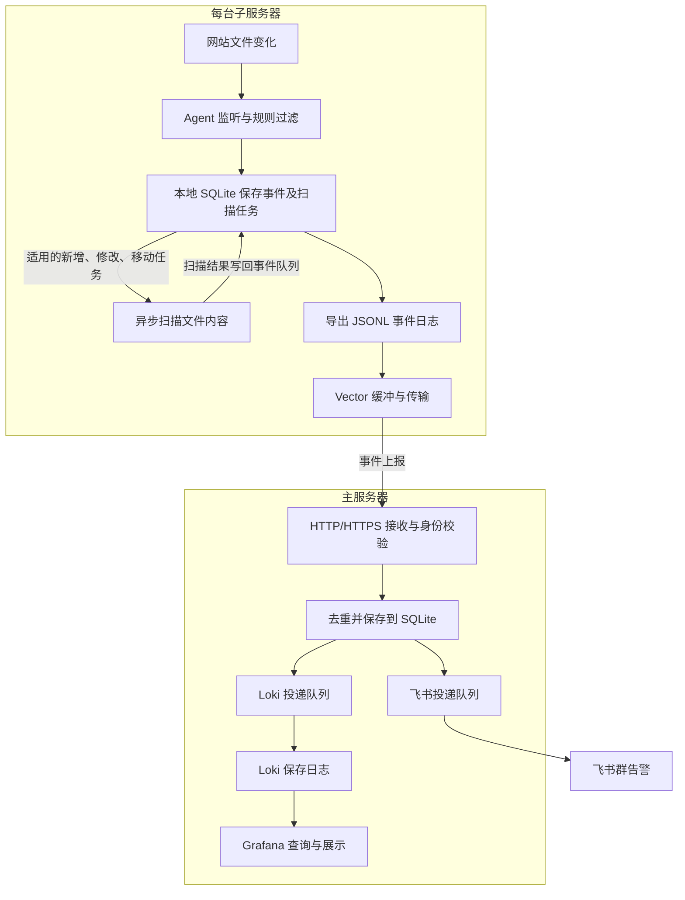
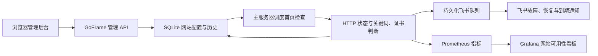

# 架构与逻辑执行顺序

[返回 README](../README.md) · [SH 安装](INSTALLATION.md) · [网站后台](WEBSITE.md) · [日常维护](OPERATIONS.md)

## 主服务器和子服务器

| 服务器 | 职责 |
|---|---|
| 主服务器 | 接收各节点的文件变化，保存事件，发送飞书通知，提供网站管理后台及 Grafana 面板，执行网站可用性检查 |
| 子服务器 | 监听本机目录，检查文件变化，扫描可疑内容，把事件发送给主服务器 |

### 架构与执行顺序

系统分为四条配合运行的链路：**文件变化检测与告警、网站可用性检测、健康指标与故障告警、部署与配置下发**。每台子服务器只监听自己的目录，主服务器负责集中接收、保存和通知。

下面的 `.go` 路径是**本地源码位置**，用于定位实现逻辑。服务器实际运行镜像内编译好的 Go 程序，不需要复制或执行这些源码。运行文件路径按 SH 默认部署说明；Compose 的宿主机文件位于各自部署包内。

### ① 启动后，先读取配置和建立监听

主、子服务分别启动，下面按职责介绍各自内部步骤；表格序号不代表部署服务器的先后顺序。

| 顺序 | 在哪个服务器 | 执行内容 | 对应源码 |
|---|---|---|---|
| 1 | 主服务器 | 接收服务读取运行配置，打开事件数据库，恢复未完成投递任务，按 SSL 设置启动 HTTP/HTTPS 接口、投递及维护任务 | `cmd/webscan/main.go`、`internal/central/central.go` |
| 2 | 每台子服务器 | Agent 读取运行配置和 YARA 规则，打开本地数据库，恢复任务状态 | `cmd/webscan/main.go`、`internal/agent/agent_linux.go` |
| 3 | 每台子服务器 | 建立 Linux inotify 目录监听，启动事件处理、扫描、日志导出和健康自检；同时核对本次启动的文件清单 | `internal/agent/agent_linux.go`、`internal/agent/coverage_linux.go` |
| 4 | 每台子服务器 | 首次安装为已有文件建立基线；已有清单则核对差异。更新就绪状态、监听覆盖及规则版本，之后持续监听和定期补查 | `internal/agent/agent_linux.go` |

这里描述各服务的启动逻辑。SH 安装时先准备子服务器监听及清单，暂缓 Vector 传输，再使主服务器配置生效，详见下方的部署顺序。

### ② 网站文件变化后，检测、传输、通知

以一台子服务器的 PHP 被修改为例：

| 顺序 | 在哪个服务器 | 做什么 | 对应源码或组件 |
|---|---|---|---|
| 1 | 发生变化的子服务器 | inotify 捕获写入完成、删除、移动及新增目录等变化，写入待处理任务 | `internal/agent/agent_linux.go` |
| 2 | 同一台子服务器 | 按忽略路径、扩展名、重要文件名和关键路径判断是否监控；需要处理时读取内容、计算 SHA256，与原清单比较 | `internal/common/policy.go`、`internal/agent/agent_linux.go`、`internal/agent/snapshot_linux.go` |
| 3 | 同一台子服务器 | 更新文件清单，保存文件变化事件；适用时建立扫描任务。内容未变化等情况不会重复生成普通修改事件 | `internal/agent/agent_linux.go` |
| 4A | 同一台子服务器 | 异步执行 YARA，以及已启用且具备服务的 ClamAV；把扫描结果另存为关联原事件的扫描事件，删除文件不扫描 | `internal/agent/scan_linux.go` |
| 4B | 同一台子服务器 | 从事件数据库导出 JSONL 日志；Vector 读取日志、使用磁盘缓冲，通过配置的 HTTP/HTTPS 上报主服务器 | `internal/agent/export_linux.go`、Vector；其配置由 `internal/deploy/render.go` 生成 |
| 5 | 主服务器 | 检查来源 IP、节点令牌和事件格式，按节点及事件 ID 去重；在数据库事务中保存事件与对应投递任务，再返回接收确认 | `internal/central/central.go` |
| 6 | 主服务器 | 两个独立后台队列分别投递飞书和 Loki。飞书按通知开关选择事件、生成中文消息、加签和限速；成功或失败均记录投递状态，失败安排重试 | `internal/central/central.go`、`internal/central/notice.go` |
| 7 | 主服务器 | Grafana 从 Loki 查询文件日志，从 Prometheus 查询健康指标；飞书群收到告警 | Grafana、Loki、Prometheus |
| 回执回流（与 6、7 并行） | 发生变化的子服务器 | Agent 查询主服务器接收回执，标记已接收；按保留期限及容量规则清理可清理的已确认日志和事件 | `internal/agent/export_linux.go` |

**4A 与 4B 是并行分支。** 文件变化通知不等待扫描结束，可能先显示“等待扫描”；之后命中可疑代码或扫描失败时，按开关另发通知。扫描消息与普通变化消息的到达顺序不能作为判断依据，“等待扫描”不代表已经检查通过。

**主服务器回执只表示事件已经持久化接收，不表示飞书或 Loki 已送达。** 后续投递由主服务器继续重试；飞书与 Loki 的队列各自运行。断网期间节点会缓存事件，恢复后补传；清单定期核对用于补查实时监听可能遗漏的变化。

### ③ 健康指标与故障告警

这条链路与普通文件通知并行，用来发现“容器运行着，但监听、扫描或传输已经异常”的情况。

| 顺序 | 在哪个服务器 | 执行内容 | 对应源码或组件 |
|---|---|---|---|
| 1 | 每台子服务器 | 在独立心跳目录周期性修改测试文件，检查监听能否捕获；更新 Agent 心跳、目录覆盖、扫描／传输状态和队列指标 | `internal/agent/export_linux.go`、`internal/agent/coverage_linux.go` |
| 2 | 子服务器 → 主服务器 | 心跳事件沿 Agent → Vector → 接收服务 → Loki 的路径传输；主服务器还查询 Loki，确认日志确实可查 | `internal/central/central.go`、`internal/central/maintenance.go` |
| 3 | 主服务器 | Prometheus 按 SSL 设置使用双向 TLS 或 HTTP 采集各节点 exporter，并采集接收服务指标；根据配置阈值计算健康告警 | exporter、Prometheus；规则由 `internal/deploy/render.go` 生成 |
| 4 | 主服务器 | Alertmanager 将故障及恢复通知交给接收服务的内部 `/alerts` 接口，再进入飞书投递队列 | Alertmanager、`internal/central/central.go`、`internal/central/notice.go` |
| 5 | 主服务器 | Grafana 展示节点在线、监听覆盖、链路自检、资源占用和积压队列 | Grafana 的服务器、健康及事件面板 |

日常备份、数据保留清理和每日飞书测试也由主服务器后台维护任务执行，实现在 `internal/central/maintenance.go`，按各自配置触发。

### ④ 部署和规则更新如何到达运行程序

SH 的配置流向为：**主服务器 `webscan.yaml` → Go 部署工具校验与合并 → 生成各服务器运行配置 → SSH 下发节点文件 → 各服务读取并生效。** 节点参数继承 `node_defaults`，单节点设置按映射合并、列表整体替换。

| 操作 | 执行顺序 | 主要源码 |
|---|---|---|
| 全新 Go 安装／完整 Go 升级 | 主服务器检查及备份 → 按配置顺序准备各子服务器 Agent、监听及清单，暂缓传输 → 主服务器应用接收及采集配置 → 逐节点启用 Vector、验收检测和投递 → 发送完成及 PHP 修改测试通知 | `cmd/bootstrap`、`internal/deploy/deploy.go`、`internal/deploy/rollout.go`、`internal/deploy/notifications.go` |
| 增加单个节点 | 主服务器检查当前服务 → 只准备所选子服务器并建立清单 → 主服务器登记该节点及采集目标 → 所选节点启用传输并验收 → 发送通知 | `internal/deploy/addition.go`、`internal/deploy/nodes.go` |
| 过滤规则／YARA 热更新 | 主服务器校验、备份并准备候选规则 → 通过 SSH 原子替换节点配置 → 节点每 5 秒检查变化，校验后应用 → 主服务器核对规则版本、容器 ID、启动时间及进程 | `internal/deploy/reload.go`、`internal/deploy/ssh.go`、`internal/agent/agent_linux.go` |

非法热更新保留旧规则，批量下发失败会尝试恢复本次已改配置；取消忽略时为已有文件安静建立基线，后续修改正常告警。根目录挂载、资源或端口等变化需要更新服务，不能通过过滤规则热更新完成。首次从旧 Python 版迁移时，先切换主服务器接收服务验证兼容，再切换节点，顺序与全新 Go 安装不同。

SH 默认运行文件位置：

| 所在服务器 | 文件或目录 | 作用 |
|---|---|---|
| 主服务器 | `/root/webscan-deploy/webscan.yaml` | 人工编辑的部署配置，常驻服务读取生成后的运行配置 |
| 主服务器 | `/opt/webscan-central/webscan-v1/runtime.json` | 接收服务的运行配置，由 `central.install_dir` 决定实际位置 |
| 主服务器 | `/var/lib/webscan-central/events-v1.sqlite3` | 接收事件、投递队列和投递记录，由 `central.data_dir` 决定实际位置 |
| 每台子服务器 | `/etc/webscan-v1/runtime.json`、`php-webshell.yar`、`vector.yml` | Agent 运行规则、YARA 特征及 Vector 传输配置 |
| 每台子服务器 | `/var/lib/webscan-v1/agent.sqlite3` | 文件清单、事件、处理任务及扫描队列 |
| 每台子服务器 | `/var/log/webscan-v1/events-*.jsonl` | Agent 导出的事件日志，供本节点 Vector 读取 |

常驻服务不会直接监视主服务器的源 YAML。SH 修改后要执行对应更新命令；Compose 修改源 YAML 也不会自动修改已上传的运行包。具体命令见[规则更新](MONITOR-RULES.md#修改后怎么生效)、[增加节点](OPERATIONS.md#增加或更新单个节点)及 [Compose 流程](COMPOSE.md)。

## 网站后台与可用性检查顺序

1. 登录后台，手动添加网站，配置立即保存到 SQLite 并加入调度；关联节点只用于分类。
2. 主服务器定时 GET 网站地址，检查 HTTP 状态、关键词及证书；不执行浏览器 JavaScript。
3. 保存检测结果及连续计数，达到故障／恢复阈值后记录事件并加入通知队列；证书提醒独立判断。
4. 后台展示状态和历史，飞书队列负责限流与重试，Grafana 查询可用性指标。

Vue 3 + Vite + TypeScript + Element Plus 页面在本地构建后嵌入 Go 程序。主服务器 central 镜像同时提供页面、API 和检测服务，服务器无需 Node.js 或额外前端容器。功能与操作见[网站后台指南](WEBSITE.md)。
