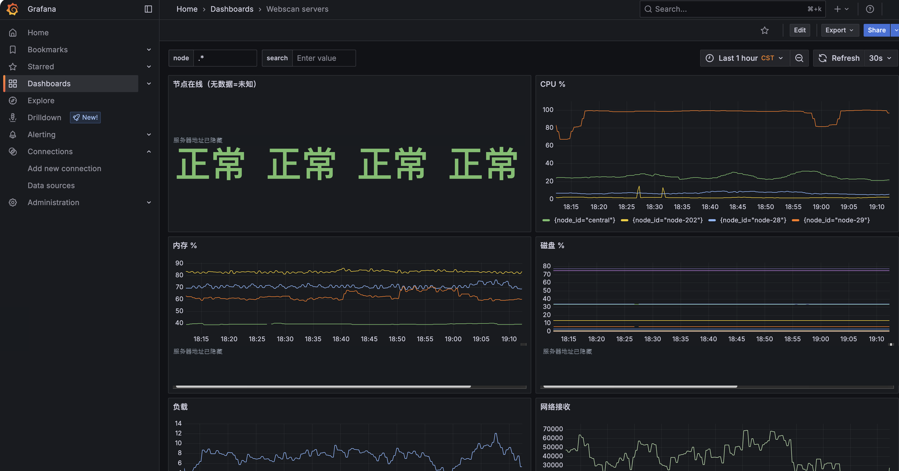
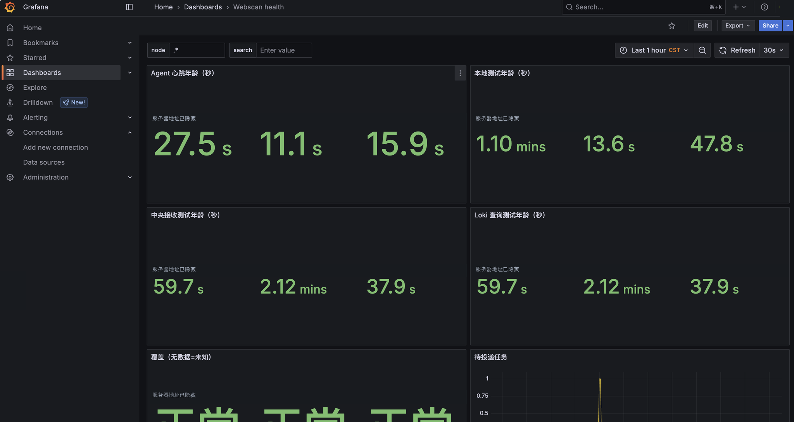

# 网站文件被改了，你多久才能知道？用 Go + Docker 把变化发到飞书

> **GitHub 项目推荐：[dzh-webscan · 网站文件监控系统](https://github.com/gzdzh-cn/dzh-webscan)**
>
> 用 Go + Docker 监控网站文件变化，通过飞书接收中文告警，在 Grafana 中查看节点健康和历史事件。源码、部署脚本及使用文档都可以从仓库查看，推荐先从 **SH 自动部署**开始。
>
> 如果这个项目对你有帮助，欢迎点一个 **Star** 收藏支持；想了解后续更新，可以通过 **Watch** 按需订阅，也欢迎通过 **Issues** 反馈问题和需求。
>
> 项目地址：https://github.com/gzdzh-cn/dzh-webscan

网站能打开，服务器 CPU 也正常，网站文件就一定没问题吗？

假设某个网站的 `config.php` 被修改，上传目录里多了一个 PHP 文件，或者重要配置被删除——如果没有人主动检查，你什么时候才能发现？

很多时候，我们监控了服务器的 CPU、内存和磁盘，却没有持续关注一个更直接的问题：**网站里的文件，正在发生什么变化？**

这篇文章介绍一套网站文件监控系统：在各台服务器上监听文件变化，通过飞书发送中文通知，再用 Grafana 查看节点健康和历史事件。自研服务使用 Go，打包为 Docker 镜像，支持通过 SH 脚本统一部署。

先看一条消息长什么样。

## 1. PHP 被修改后，飞书里能看到什么？

下面是一条脱敏后的消息示意，具体内容以实际配置和事件为准：

```text
【网站监控】发现文件被修改

服务器：网站节点 A（198.51.100.20）
网站：example.com
文件：/www/wwwroot/example.com/config/config.php
发生时间：2026-10-07 10:30:00（北京时间）
安全检查：等待扫描，发现可疑内容会另行通知
处理建议：如果不是您或网站程序的正常更新，请检查该文件
```

你可以直接知道：哪台服务器、哪个网站、哪个文件、发生了什么，以及什么时候发生。

除了修改，系统还会检测新增、删除、移动或改名。符合扫描条件的文件会进入 YARA 扫描流程，命中可疑规则时，根据通知配置另发消息。

这里有个关键区别：**文件变化通知和安全扫描结果是两件事。**

“等待扫描”表示还没有结果；文件被修改也不等于遭到攻击。正常发布、插件更新和配置调整，同样可能触发通知。收到消息后，需要结合自己的操作记录判断。

## 2. 多台服务器，不用每台单独盯

系统分为主服务器和子服务器两类角色：

- **每台子服务器**：监听本机目录，核对文件内容，扫描可疑代码，缓存和上报事件。
- **主服务器**：集中接收事件、保存记录、发送飞书通知，提供 Grafana 查询面板。

一次文件变化的主要路径是：

```text
子服务器：文件变化 → Agent 检测 → 本地保存 → Vector 传输
                                           ↓
主服务器：HTTPS 接收 → 去重与保存 → 飞书通知 / Loki 日志
                                           ↓
                                    Grafana 查询
```

扫描与事件传输异步执行，所以普通变化通知不必等扫描完成。主服务器给出的接收回执表示事件已经保存，飞书和 Loki 是否投递成功，则由各自的后台队列继续跟踪。

节点断网期间会缓存事件，网络恢复后补传；文件清单还会定期核对，补查实时监听可能遗漏的变化。数据保留期限、磁盘容量和监控中断时间仍然需要合理设置，例如停机期间创建后立即删除的文件，恢复后未必能补查。

## 3. 真正影响使用体验的，是能不能少发无用通知

如果把所有文件变化都发进群，缓存、临时文件、程序自动生成的内容很快就会淹没有价值的消息。

因此，这套系统支持监控多个目录、自定义文件后缀、重要文件名、关键文件路径，以及使用通配符忽略缓存目录。

例如，公共规则可以这样写：

```yaml
node_defaults:
  monitor:
    roots:
      - /www/wwwroot
    extensions:
      - .php
      - .phtml
      - .js
      - .html
      - .css
    exclude_paths:
      - /www/wwwroot/*/**/runtime/**/cache
      - /www/wwwroot/*/caches/temp
    important_filenames:
      - .user.ini
      - .htaccess
```

这里的 `*` 匹配一个路径段，`**` 匹配零层或多层目录。匹配到缓存目录后，其下的文件和子目录一起忽略，不需要为每个网站逐条填写。

这些配置片段需要合并到完整 YAML 中。后缀列表要保留所有需要监控的类型，忽略规则也应根据实际网站目录设置，避免把需要关注的 PHP 文件一起排除。

**每台子服务器还可以有自己的规则。** 比如节点 B 除了网站目录，还要监控 `/data/sites`：

```yaml
nodes:
  - id: node-b
    # 此处省略该节点已有的名称、IP 和 SSH 配置
    monitor:
      roots:
        - /www/wwwroot
        - /data/sites
```

注意，节点列表配置会整体替换继承的列表。要同时监控两个目录，就把两个目录都写上。

## 4. 改过滤规则，不用每次重启节点

在主服务器修改 YAML 后，可以下发过滤规则：

```bash
bash deploy-webscan.sh --reload-rules
```

节点每 5 秒检查规则变化，校验通过后应用，非法规则保留旧版。忽略路径、后缀和重要文件名等过滤规则可以热更新，不需要重建容器。

取消忽略时，系统先为已有文件建立基线，后续变化再正常通知，避免把缓存目录里的存量文件都当成刚刚新增。

新增监控根目录则涉及容器挂载，需要更新对应节点：

```bash
bash deploy-webscan.sh --add-node --node node-b
```

日常使用中，先分清修改的是“过滤规则”还是“挂载目录”，就能选对更新方式。

## 5. 容器运行着，不代表监控真的正常

这是做监控很容易忽略的问题。

容器状态显示 Running，却可能出现目录监听不完整、扫描任务积压、传输中断，或者飞书投递失败。因此，检查容器之外，还需要检查整条链路。

Grafana 提供服务器、健康和事件面板，可以查看节点在线情况、目录监听覆盖、心跳、扫描与投递队列，以及资源使用情况。



*服务器面板：集中查看各节点的资源和运行状态。*



*健康面板：结合心跳、覆盖和积压指标检查监控链路。*

排查问题时，可以先按三个问题检查：

1. **节点是否可达？** 检查指标采集和网络连接。
2. **文件变化是否被发现？** 检查心跳、监听覆盖和本地队列。
3. **消息是否送达？** 检查主服务器投递记录及 Loki 日志。

面板的颜色只是辅助。更可靠的方法，是结合指标更新时间、阈值和真实测试事件判断。飞书接口返回成功，也表示机器人接口接受了消息，并不表示群成员已经阅读。

## 6. 两种安装方式，优先推荐 SH 自动部署

### 方式 1：SH 自动部署，统一管理多台服务器

在主服务器准备部署包：

```text
/root/webscan-deploy/
├── deploy-webscan.sh
├── webscan.yaml
└── README.md
```

按完整配置示例填写主服务器地址、各节点 SSH 信息、监控路径和飞书机器人凭据，并放行所需的云安全组及系统防火墙端口。

然后在主服务器执行：

```bash
cd /root/webscan-deploy
chmod 600 webscan.yaml

# 校验配置并预览操作
bash deploy-webscan.sh --dry-run

# 打开部署菜单，选择 1 安装
bash deploy-webscan.sh
```

菜单包含安装、重装、卸载和增加子服务器。脚本通过 SSH 操作启用的节点，服务器无需安装 Python 或 Go 编译环境。运行环境为 Linux amd64，需要 Docker 和 Compose；缺少 Docker 时，自动安装支持 Debian／Ubuntu。

**它的价值是把环境检查、配置下发、启动、验收和失败恢复放在同一条流程里。** 不必逐台登录，手动重复执行相同操作。

全新 Go 部署会先准备节点监听和文件清单，暂缓传输，再应用主服务器配置，最后逐台启用传输并验收。首次清单建立速度取决于文件数量、目录数量和磁盘性能，不能只用“容器已经起来了”判断完成。

### 方式 2：Docker Compose，适合自行管理各台服务器

需要自己控制每台服务器启动过程时，可以使用 Compose。

在本地源码目录填写配置，再生成每台服务器的专用部署包：

```bash
cp webscan.example.yaml webscan.compose.yaml
chmod 600 webscan.compose.yaml

# 编辑配置，填写服务器信息和飞书凭据后执行
go run ./cmd/compose --config webscan.compose.yaml --output compose-deploy
```

本地生成需要 Go 环境；运行服务器不需要。将主服务器包和各节点包分别上传，再按教程执行 `docker compose up -d` 等启动命令。节点应先启动 Agent 和 exporter，确认清单及监听就绪后，再启动 Vector。

不同节点拥有自己的身份和证书，不能直接复制另一台节点的运行包。完整步骤见项目的 [Compose 部署教程](COMPOSE.md)。

自研服务提供两个 Docker Hub 公开镜像：

- [gzdzh/webscan-central](https://hub.docker.com/r/gzdzh/webscan-central)：主服务器接收服务，包含部署工具。
- [gzdzh/webscan-agent](https://hub.docker.com/r/gzdzh/webscan-agent)：子服务器文件监控程序。

公开拉取无需账号密码。完整系统还包含 Vector、Grafana、Loki、Prometheus 等组件，不能只启动这两个镜像就认为已经部署完成。正式部署使用发布版本及固定摘要，具体以配套 YAML 为准。

## 7. 装好以后，必须做一次真实验证

一套文件监控是否可用，最终要通过真实文件变化来确认。

SH 部署流程会使用独立测试目录，验证文件检测、扫描及消息投递；飞书开启时，还会发送部署完成通知和各节点部署后的 PHP 修改测试通知。单独增加节点也会执行对应测试。

验收不需要修改业务网站文件，也不需要执行测试 PHP 内容。

实际使用时，可以重点核对：

- 飞书是否收到预期通知，时间和服务器名称是否正确。
- Loki 是否能查询到对应事件。
- Grafana 中的心跳、监听覆盖和采集目标是否正常。
- 测试结束后，扫描及投递队列是否恢复到正常水平。

YARA 根据已有规则识别可疑内容，规则没有命中不能证明文件一定安全。系统提供的是变化检测和调查线索，仍需要结合代码审核、访问日志和实际业务判断。

## 8. 这套系统适合谁？

如果你维护着多个 PHP 网站，服务器分散在不同云平台，希望文件变化有人提醒、历史记录能够查询、节点故障也能发现，这套方案值得尝试。

从一台测试节点开始，配置最需要关注的目录和文件类型，排除确认无须告警的缓存，再验证检测到飞书的整条链路。规则稳定后，再逐步接入其他服务器。

Go 程序的实际资源占用与目录数量、文件规模、扫描频率和队列积压有关；整套系统还包含监控组件，选型应看完整容器的 CPU 和内存数据，不能只凭语言判断性能。

**如果现在只做一个检查：你的重要配置文件被修改后，有没有一条可靠的通知能告诉你？**

你的网站最希望监控哪些文件：PHP 源码、配置文件，还是上传目录中的异常脚本？欢迎在评论区分享场景，后续可以围绕这些需求继续介绍规则配置和排查方法。

---

## 配套资料

- [完整使用说明与 SH 安装](../README.md)
- [Grafana 查询使用指南](GRAFANA.md)
- [Docker Compose 部署教程](COMPOSE.md)
- [参数填写与报错说明](PARAMETERS.md)

---

## 发布备注（发布正文时删除此节）

**CSDN 推荐标题：**《Go + Docker 网站文件监控实战：飞书告警、规则热更新与 Grafana 查询》

**今日头条推荐标题：**《网站还能打开，文件却被改了？给你的服务器加一双“眼睛”》

**摘要：**服务器在线，不代表网站文件没有异常变化。本文介绍一套 Go + Docker 网站文件监控方案：发现新增、修改、删除和改名，用飞书发送中文通知，通过 Grafana 检查节点健康，并支持通配符过滤及规则热更新。

**标签建议：**Go、Docker、网站安全、运维、飞书、Grafana。

CSDN 可保留完整代码块；今日头条建议使用较短代码块，必要时将配置示例转换为清晰的代码截图。两张 Grafana 图片已隐藏服务器地址，发布时上传图片，替换本地图片链接。

公开 GitHub 仓库已放在文章头部。配套资料仍是项目内的相对链接，发布前替换为仓库中对应文档的公开链接。不要把本地目录、实际 YAML、Webhooks、令牌或服务器私钥作为下载附件。

正文未提供未经实测的性能降幅或检测时效承诺。文章可以帮助展示项目价值，实际传播效果取决于受众、封面和持续内容更新。
